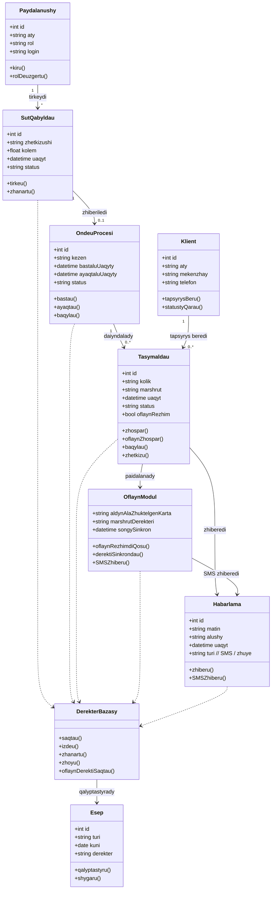

# Class диаграммасы

```mermaid
classDiagram
  class Paydalanushy {
    +int id
    +string aty
    +string rol
    +string login
    +kiru()
    +rolDeuzgertu()
  }
  class SutQabyldau {
    +int id
    +string zhetkizushi
    +float kolem
    +datetime uaqyt
    +string status
    +tirkeu()
    +zhanartu()
  }
  class OndeuProcesi {
    +int id
    +string kezen
    +datetime bastaluUaqyty
    +datetime ayaqtaluUaqyty
    +string status
    +bastau()
    +ayaqtau()
    +baqylau()
  }
  class Klient {
    +int id
    +string aty
    +string mekenzhay
    +string telefon
    +tapsyrysBeru()
    +statustyQarau()
  }
  class Tasymaldau {
    +int id
    +string kolik
    +string marshrut
    +datetime uaqyt
    +string status
    +bool oflaynRezhim
    +zhospar()
    +oflaynZhospar()
    +baqylau()
    +zhetkizu()
  }
  class OflaynModul {
    +string aldynAlaZhuktelgenKarta
    +string marshrutDerekteri
    +datetime songySinkron
    +oflaynRezhimdiQosu()
    +derektiSinkrondau()
    +SMSZhiberu()
  }
  class Habarlama {
    +int id
    +string matin
    +string alushy
    +datetime uaqyt
    +string turi  // SMS / zhuye
    +zhiberu()
    +SMSZhiberu()
  }
  class DerekterBazasy {
    +saqtau()
    +izdeu()
    +zhanartu()
    +zhoyu()
    +oflaynDerektiSaqtau()
  }
  class Esep {
    +int id
    +string turi
    +date kuni
    +string derekter
    +qalyptastyru()
    +shygaru()
  }

  Paydalanushy "1" --> "*" SutQabyldau : tirkeydi
  SutQabyldau "1" --> "0..1" OndeuProcesi : zhiberiledi
  OndeuProcesi "1" --> "0..*" Tasymaldau : daiyndalady
  Klient "1" --> "0..*" Tasymaldau : tapsyrys beredi
  Tasymaldau --> OflaynModul : paidalanady
  Tasymaldau --> Habarlama : zhiberedi
  OflaynModul --> Habarlama : SMS zhiberedi
  SutQabyldau ..> DerekterBazasy
  OndeuProcesi ..> DerekterBazasy
  Tasymaldau ..> DerekterBazasy
  OflaynModul ..> DerekterBazasy
  Habarlama ..> DerekterBazasy
  DerekterBazasy --> Esep : qalyptastyrady
```

Ескерту: Сапа бақылау сыныбы TO-BE бойынша жойылған. Оффлайн атрибуттар мен әдістер қосылған.
