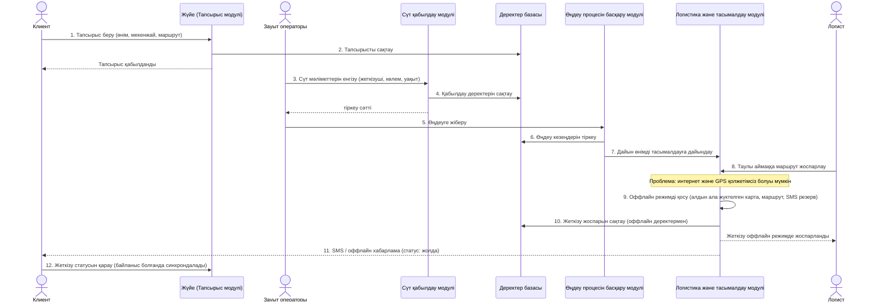

# Sequence диаграммасы

```mermaid
sequenceDiagram
  actor K as Клиент
  participant T as Жүйе (Тапсырыс модулі)
  actor O as Зауыт операторы
  participant Q as Сүт қабылдау модулі
  participant DB as Деректер базасы
  participant P as Өңдеу процесін басқару модулі
  participant L as Логистика және тасымалдау модулі
  actor LG as Логист

  K->>T: 1. Тапсырыс беру (өнім, мекенжай, маршрут)
  T->>DB: 2. Тапсырысты сақтау
  T-->>K: Тапсырыс қабылданды
  O->>Q: 3. Сүт мәліметтерін енгізу (жеткізуші, көлем, уақыт)
  Q->>DB: 4. Қабылдау деректерін сақтау
  Q-->>O: тіркеу сәтті
  O->>P: 5. Өңдеуге жіберу
  P->>DB: 6. Өңдеу кезеңдерін тіркеу
  P->>L: 7. Дайын өнімді тасымалдауға дайындау
  LG->>L: 8. Таулы аймаққа маршрут жоспарлау
  Note over L: Проблема: интернет және GPS қолжетімсіз болуы мүмкін
  L->>L: 9. Оффлайн режимді қосу (алдын ала жүктелген карта, маршрут, SMS резерв)
  L->>DB: 10. Жеткізу жоспарын сақтау (оффлайн деректермен)
  L-->>LG: Жеткізу оффлайн режимде жоспарланды
  L-->>K: 11. SMS / оффлайн хабарлама (статус: жолда)
  K->>T: 12. Жеткізу статусын қарау (байланыс болғанда синхрондалады)
```
